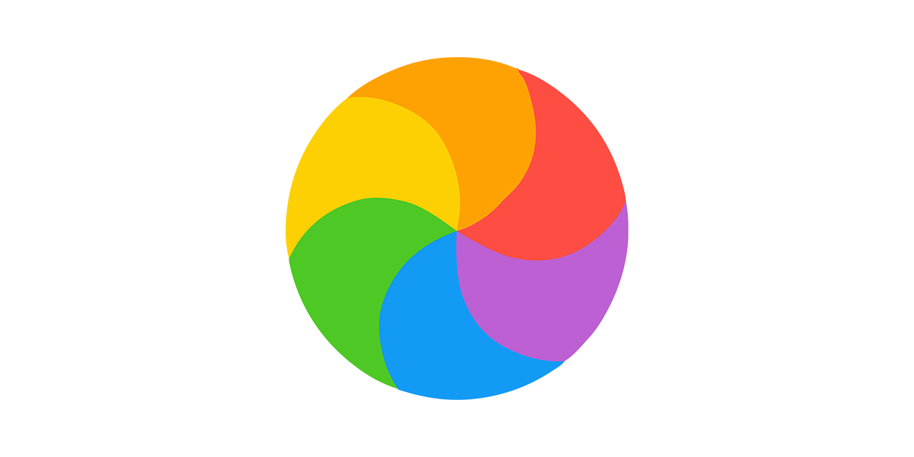

# Colors Helper

`Colors Helper` is part of the `AI Helpers` collection developed for working with colors in AI and digital applications.

[🕸️ AI Helpers](https://harchaoui.org/warith/ai-helpers)

The colors have been chosen with 2 sources:

  + macos colors available at [Apple Developer Color Guidelines](https://developer.apple.com/design/human-interface-guidelines/color#macOS-system-colors)

  + and light colors according to [Tint & Shade Generator](https://maketintsandshades.com)


[](https://harchaoui.org/warith/ai-helpers)

Colors Helper is a Python library that uses Apple carefuly chosen colors and provides utility functions for color manipulation, conversion, and palette management. It includes features like converting colors between formats, generating light counterparts, and managing a centralized color palette.

# Installation

## Install Package

We recommend using Python environments. If you need help setting one up, check out:

[🥸 Tech tips](https://harchaoui.org/warith/4ml/#install)

To install Colors Helper, simply run:

```bash
pip install --force-reinstall --no-cache-dir git+https://github.com/warith-harchaoui/colors-helper.git@main
```

# Usage

You can find many examples here:

[📋 Examples](EXAMPLES.md)


# Some elements of color psychology (to be improved)

Colors can evoke emotions and associations. Here’s a brief overview of common associations, though they can vary across cultures:

 + Red: Excitement, passion, and urgency.
 + Blue: Trust, calmness, and reliability.
 + Green: Growth, nature, and stability.
 + Purple: Luxury, creativity, and mystery.
 + Black: Power, elegance, and sophistication.
 + White: Cleanliness, simplicity, and peace.

 # Authors
  - [Warith Harchaoui](https://deraison.ai)
  - [Laurent Pantanacce](https://www.linkedin.com/in/pantanacce/)
